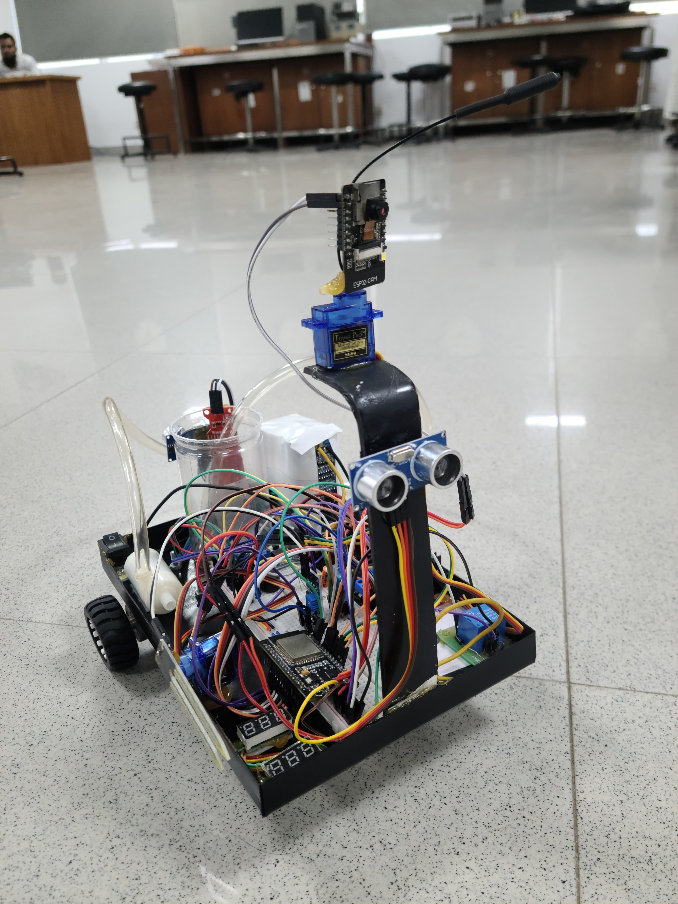
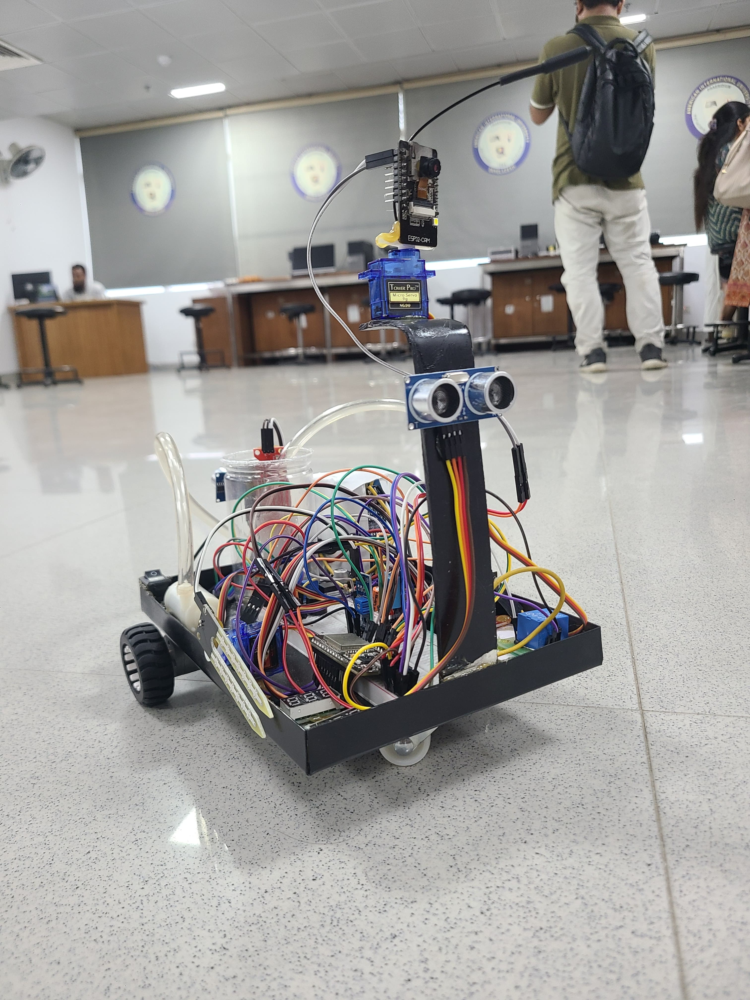

# AgroBot - Autonomous Farming Operator

AgroBot is an advanced agricultural robot built for remote farming tasks, live monitoring, and future autonomy upgrades. The project combines ESP32-based control, ESP32-CAM streaming, and modular expansion for sensors, watering, and navigation.

## Project Images

### Robot Views






## Overview

The current build focuses on remote control, live video streaming, and network flexibility. The next phases add environmental sensing, obstacle detection, automated watering, and location-aware navigation.

## Features

### Phase 1 - Current Implementation
- Remote control through a web interface
- Live video streaming through ESP32-CAM
- WiFi and hotspot network modes
- Auto-stop and connection monitoring for safety

### Phase 2 - Planned Expansion
- DHT11 temperature and humidity monitoring
- Soil moisture sensing and analysis
- Ultrasonic obstacle detection
- Water pump automation with level monitoring
- GPS-assisted navigation and field mapping

## Hardware

### Electronics
| Component | Quantity | Purpose |
|-----------|----------|---------|
| ESP32 DevKit | 1 | Main controller |
| ESP32-CAM | 1 | Video streaming |
| L298N Motor Driver | 1 | Motor control |
| 12V Gear Motors | 2 | Movement |
| DHT11 Sensor | 1 | Temperature/Humidity |
| Soil Moisture Sensor | 1 | Soil analysis |
| HC-SR04 Ultrasonic | 1 | Obstacle detection |
| Water Level Sensor | 1 | Tank monitoring |
| 5V Water Pump | 1 | Irrigation |
| Relay Module | 1 | Pump control |
| Servo Motor | 1 | Camera pan/tilt |

### Power System
| Component | Quantity | Specification |
|-----------|----------|---------------|
| Li-Po Battery | 12 | 3.7V cells in series/parallel configuration |
| BMS Module | 1 | Battery management |
| Step-down Converter | 2 | 12V to 5V, 12V to 3.3V |

### Mechanical
- Stainless steel chassis
- 2x robot wheels
- Water tank with pipes and nozzles
- Mounting brackets
- Protective enclosures

## Web Interface

### Control Features
- Movement controls: forward, backward, left, right, stop
- Live video feed with capture support
- Status monitoring for connection, motors, and sensors
- Safety controls including emergency stop and motor disable

### Responsive Design
- Mobile-friendly interface
- Touch controls for mobile devices
- Auto-refresh and reconnection support

## Circuit Connections

### Main ESP32 Connections
| ESP32 Pin | Component | Description |
|-----------|-----------|-------------|
| GPIO 26 | Motor A Pin 1 | Left motor control |
| GPIO 27 | Motor A Pin 2 | Left motor control |
| GPIO 14 | Motor A Enable | Left motor speed (PWM) |
| GPIO 32 | Motor B Pin 1 | Right motor control |
| GPIO 33 | Motor B Pin 2 | Right motor control |
| GPIO 25 | Motor B Enable | Right motor speed (PWM) |
| GPIO 2 | Status LED | System status indicator |
| GPIO 4 | DHT11 Data | Temperature/Humidity |
| GPIO 5 | Soil Moisture | Analog input |
| GPIO 18 | Ultrasonic Trig | Distance sensor trigger |
| GPIO 19 | Ultrasonic Echo | Distance sensor echo |
| GPIO 21 | Water Level | Tank level sensor |
| GPIO 22 | Relay Control | Pump activation |
| GPIO 23 | Servo Control | Camera positioning |
| 3.3V | Sensors VCC | Power supply |
| GND | Common Ground | Ground connection |

### ESP32-CAM Connections
| ESP32-CAM Pin | Function |
|--------------|----------|
| GPIO 4 | Flash LED |
| GPIO 33 | Status LED (optional) |
| 5V | Power input |
| GND | Ground |
| Built-in pins | Camera module (pre-wired) |

### Motor Driver Connections
| L298N Pin | Connection |
|----------|------------|
| VCC | 12V Battery |
| GND | Common Ground |
| IN1 | ESP32 GPIO 26 |
| IN2 | ESP32 GPIO 27 |
| IN3 | ESP32 GPIO 32 |
| IN4 | ESP32 GPIO 33 |
| ENA | ESP32 GPIO 14 |
| ENB | ESP32 GPIO 25 |
| OUT1/OUT2 | Left Motor |
| OUT3/OUT4 | Right Motor |

## Power System

### Battery Configuration
- Series configuration: 3 groups of 4 batteries for higher voltage output
- Parallel configuration: 3 groups in parallel for capacity
- Total output: approximately 12V to 14.8V
- BMS protection for overcharge, over-discharge, and current control

### Voltage Regulation
- 12V rail for motors and pump
- 5V rail for ESP32-CAM, sensors, and relay
- 3.3V rail for ESP32 and compatible sensors

## Getting Started

### 1. Hardware Setup
1. Assemble the chassis and mount all components
2. Wire the circuit according to the pin mapping
3. Install and configure the power system
4. Mount the ESP32-CAM for a clear field of view

### 2. Software Installation
1. Install Arduino IDE
2. Add ESP32 board support
3. Install required libraries:
   - WiFi
   - WebServer
   - ESP32Camera
   - DHT sensor library for Phase 2

### 3. Configuration
1. Update WiFi credentials in both code files:

```cpp
const char* wifi_ssid = "YOUR_WIFI_SSID";
const char* wifi_password = "YOUR_WIFI_PASS";
```

2. Upload `agrobot_main.ino` to the main ESP32
3. Upload `esp32cam_stream.ino` to the ESP32-CAM

### 4. Operation
1. Power on the system
2. Wait for the network connection indicator
3. Open the web interface:
   - WiFi mode: `http://[ESP32_IP]`
   - Hotspot mode: `http://192.168.4.1`
4. Use the directional controls to move the robot
5. Monitor the live video feed

## Troubleshooting

### Common Issues
1. Camera not streaming
   - Check the ESP32-CAM power supply
   - Verify the network connection
   - Reset the ESP32-CAM module

2. Motors not responding
   - Check motor driver wiring
   - Verify the power supply voltage
   - Test the motor enable and disable control

3. Network connection issues
   - Verify WiFi credentials
   - Check hotspot mode activation
   - Review serial output for debugging

## Performance Optimizations

### Phase 1 Improvements
1. Tune JPEG quality and frame size for video performance
2. Optimize command processing delays for responsiveness
3. Add sleep modes and power management for battery life
4. Expand range with WiFi extenders or mesh networking

### Phase 2 Enhancements
1. Add computer vision for crop detection
2. Log sensor data for analysis
3. Implement autonomous path planning and GPS navigation
4. Build a dedicated mobile application

## Research Contribution

### Novel Aspects
1. Dual network architecture with WiFi and hotspot switching
2. Real-time video plus sensor-ready monitoring
3. Platform-independent web-based control
4. Modular design for scalable expansion

### Research Areas
1. Precision agriculture and targeted resource delivery
2. IoT-based remote monitoring and control
3. Computer vision for crop health and pest detection
4. Sustainable farming and resource optimization

### Experimental Metrics
- Navigation accuracy
- Sensor precision
- System reliability
- Energy efficiency
- User experience

## Development Roadmap

### Phase 1 - Current
- Basic movement control
- Video streaming
- Web interface
- Network management

### Phase 2 - Next
- Environmental sensors
- Obstacle avoidance
- Automated watering
- Data logging

### Phase 3 - Future
- AI and machine learning integration
- GPS navigation
- Mobile application
- Cloud connectivity

### Phase 4 - Advanced
- Swarm robotics
- Predictive analytics
- Blockchain integration
- Edge computing

## Academic References

1. Precision agriculture and variable rate technology
2. Robotics in agriculture and autonomous systems
3. IoT networks, mesh networking, and edge computing
4. Computer vision for object detection and classification
5. Sustainable technology and energy efficiency

## Research Paper

Development and Implementation of an IoT-Based Autonomous Agribot for Precision Farming: [ResearchGate publication](https://www.researchgate.net/publication/398689292_Development_and_Implementation_of_an_IoT-Based_Autonomous_Agribot_for_Precision_Farming)

## Contributing

This project is intended for academic and research use. Contributions are welcome for hardware improvements, software enhancements, algorithm development, and documentation updates.

## License

This project is open-source and available for academic and research use. Please cite appropriately in academic publications.
